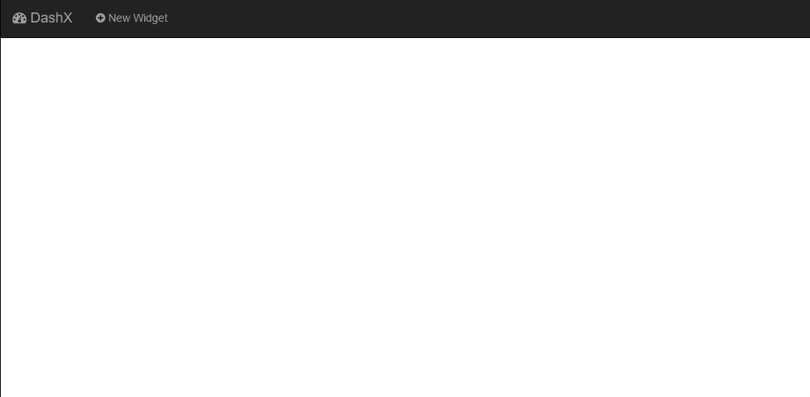

DashX - A Node.js/ReactJS Dashboard
---------------------------

This module is under development. For any question please email me@miladrk.com

Steps to setup and use the tool :

1. get the source from git 

`git clone https://github.com/milianoo/dashx.git`

2. install node dependencies

`npm install`

3. install bower dependencies

`bower install` 

4. generate js bundle 

`webpack`

Project plan 
------------

Iteration 1
===========

1. create dashboard basic design 
2. add basic widget to dashboard
3. load basic info for widget
4. setup timer to reload widget

Iteration 2
===========

1. make dashboard dynamic to load using config file
2. load widget data from api 
3. load widget UI from template
4. setup config file for each widget
5. enhance UI of widget 

iteration 3
===========

1. ability to re-size widgets
2. drag-n-drop widgets
3. error handling 
4. generate new widget using grunt 
5. load widgets on load from config file

# License

> The MIT License (MIT)
>
> Copyright (c) 2016 Milad Rezazadeh
>
> Permission is hereby granted, free of charge, to any person obtaining a copy of this software and associated documentation files (the "Software"), to deal in the Software without restriction, including without limitation the rights to use, copy, modify, merge, publish, distribute, sublicense, and/or sell copies of the Software, and to permit persons to whom the Software is furnished to do so, subject to the following conditions:
> 
> The above copyright notice and this permission notice shall be included in all copies or substantial portions of the Software.
> 
> THE SOFTWARE IS PROVIDED "AS IS", WITHOUT WARRANTY OF ANY KIND, EXPRESS OR IMPLIED, INCLUDING BUT NOT LIMITED TO THE WARRANTIES OF MERCHANTABILITY, FITNESS FOR A PARTICULAR PURPOSE AND NONINFRINGEMENT. IN NO EVENT SHALL THE AUTHORS OR COPYRIGHT HOLDERS BE LIABLE FOR ANY CLAIM, DAMAGES OR OTHER LIABILITY, WHETHER IN AN ACTION OF CONTRACT, TORT OR OTHERWISE, ARISING FROM, OUT OF OR IN CONNECTION WITH THE SOFTWARE OR THE USE OR OTHER DEALINGS IN THE SOFTWARE.